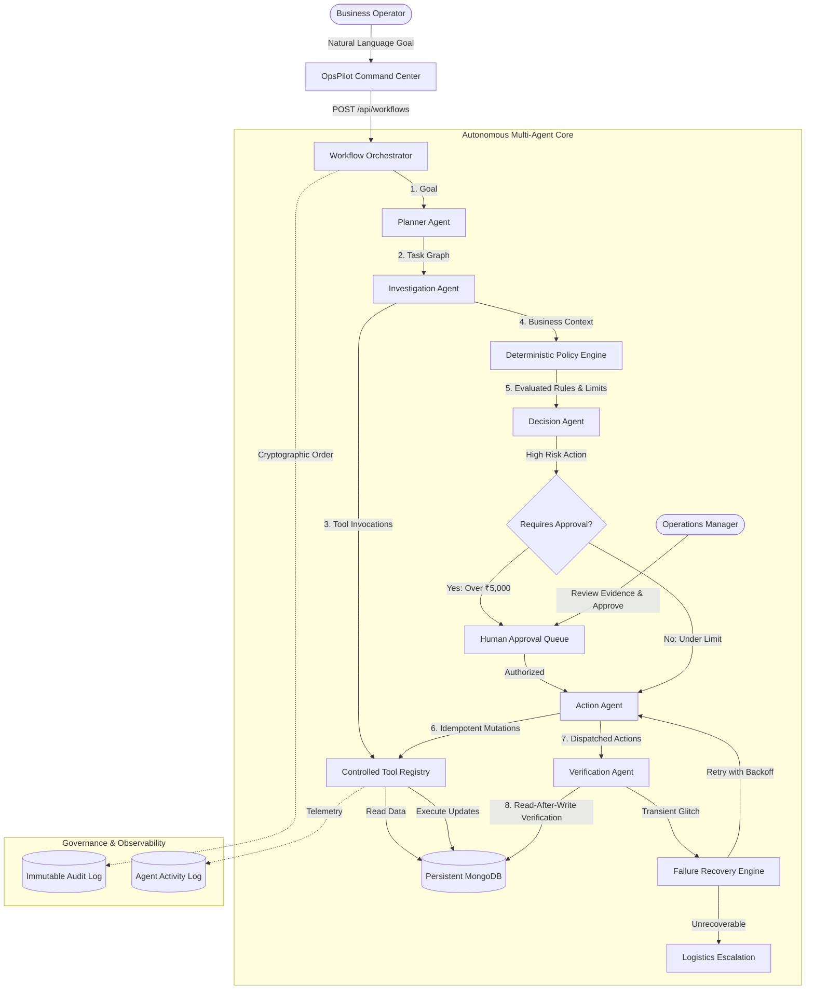

# 🚀 OpsPilot AI — From Business Goal to Verified Action

> **Autonomous Agentic Operations Platform**: Turns high-level business goals into planned, policy-checked, human-supervised, verified operational actions.

[](https://opensource.org/licenses/MIT)
[](https://nodejs.org/)
[](https://reactjs.org/)
[](https://ai.google.dev/)
[](https://mongoosejs.com/)

---

## 🌟 The Core Architectural Principle

```text
THE LLM REASONS.
THE APPLICATION CONTROLS AUTHORITY.
```

The LLM is an intelligent reasoning engine that understands intent, decomposes work, and evaluates evidence. **It is never granted direct database mutation authority or unvetted financial privileges.** The deterministic application layer strictly enforces policy limits, authorization tokens, idempotency, read-after-write verification, and Human-in-the-Loop checkpoints.

---

## 🏗️ Architecture Overview



---

## ⚡ Multi-Agent Responsibilities

| Agent | Responsibility | Authority Boundary |
| :--- | :--- | :--- |
| **Planner Agent** | Decomposes business goal into task graph with dependencies & required tools | Read-only reasoning |
| **Investigation Agent** | Queries operational entities (orders, shipments, customers) via Tool Registry | Read-only tool access |
| **Policy Engine** | Evaluates deterministic business rules (₹5k refund threshold, VIP priority, 48h delays) | Hard-coded application logic |
| **Decision Agent** | Synthesizes findings into structured action proposals with evidence checklists | Proposal only, no mutations |
| **HITL Approval Agent** | Pauses execution when high-value thresholds are crossed, awaiting manager sign-off | Human-in-the-loop gatekeeper |
| **Action Agent** | Executes safe state mutations using unique `idempotencyKey` tokens | Safe mutations via Tool Registry |
| **Verification Agent** | Re-queries persistent MongoDB to verify database state matches expected outcomes | Read-after-write verification |
| **Recovery Engine** | Handles transient network errors with exponential backoff before escalating | Automated self-healing |

---

## 💼 Supported Operational Use Cases

1. **Delayed Orders Remediation**: Detect stalled couriers, prioritize VIP customers, auto-refund under ₹5,000, and request approval above ₹5,000.
2. **Customer Escalation Triage**: Pinpoint high-risk tickets, elevate priority, and link shipments.
3. **Refund Processing Governance**: Zero duplicate refunds via cryptographic idempotency keys.
4. **Inventory Stockout Prevention**: Track daily burn rate and trigger purchase replenishment for items under 3 days of stock.
5. **SLA Breach Mitigation**: Proactively identify support cases nearing SLA breach.
6. **Self-Healing Recovery**: Automatically recover from transient courier and notification provider 504 timeouts.

---

## 🛠️ Technology Stack

- **Frontend**: React 18, Vite, Tailwind CSS, Lucide React, Recharts, Axios, React Router Dom.
- **Backend**: Node.js v22, Express, Helmet, CORS, Express Rate Limit, Zod, JWT, bcryptjs.
- **Database**: MongoDB + Mongoose (with automated embedded `mongodb-memory-server` fallback for zero-configuration hackathon startup).
- **AI Integration**: Google Gemini API (`gemini-1.5-flash` / `gemini-2.0-flash`) with strict Zod validation and deterministic reasoning fallback.

---

## 🚦 Quick Start Guide

### 1. Prerequisites
- Node.js (v18 or higher)
- npm (v9 or higher)

### 2. Clone and Setup Environment
```bash
# Clone the repository
git clone https://github.com/Rishabhgupta0520/opspilot-ai.git
cd opspilot-ai

# Backend Environment
cp .env.example backend/.env
```

### 3. Install Dependencies
```bash
npm run install:all
```

### 4. Run Automated Test Suite
```bash
npm run test:backend
```
*(Runs 5 end-to-end integration tests verifying Auth, Policies, Tools, Idempotency, and Multi-Agent Workflow Execution)*

### 5. Start Backend and Frontend
In terminal 1 (Backend on port 5001):
```bash
npm run dev:backend
```

In terminal 2 (Frontend on port 5173):
```bash
npm run dev:frontend
```

Open your browser at **`http://localhost:5173`**.

---

## 👥 Hackathon Demo Personas

| Role | Email | Password | Authority |
| :--- | :--- | :--- | :--- |
| **Manager** | `manager@opspilot.ai` | `Manager@123456` | Can authorize high-risk/high-value actions (&gt;₹5,000) |
| **Admin** | `admin@opspilot.ai` | `Admin@123456` | Full platform control & policy configuration |
| **Operator** | `operator@opspilot.ai` | `Operator@123456` | Submit goals and monitor execution |
| **Viewer** | `viewer@opspilot.ai` | `Viewer@123456` | Read-only compliance and audit access |

---

## 🎯 Deterministic Hackathon Demo Dataset

The platform seeds a verified, deterministic test dataset containing **17 delayed orders**:
- **12 orders** automatically resolvable (&le; ₹5,000 threshold or proactive notifications).
- **3 orders** requiring manager approval (e.g. `ORD-1042` ₹15,000 for VIP Amit Sharma).
- **1 order** demonstrating recoverable network failure (`ORD-1032` notification gateway timeout retrying and succeeding on attempt #2).
- **1 order** with an unrecoverable missing package (`ORD-1088` delayed 104 hours) escalating to senior logistics.

*To reset to baseline at any moment, click **"Reset Demo Dataset"** in the sidebar or call `POST /api/demo/reset`.*

---

## 📑 API Endpoints Summary

- `POST /api/auth/login` — Sign in
- `POST /api/workflows` — Launch autonomous goal workflow
- `GET /api/workflows/:id` — Inspect real-time agent execution graph and state
- `GET /api/approvals` — List pending high-risk approval requests
- `POST /api/approvals/:id/approve` — Manager approval authorization
- `POST /api/approvals/:id/reject` — Manager rejection and escalation
- `GET /api/orders` — Orders telemetry directory
- `GET /api/customers` — Customer intelligence & VIP accounts
- `GET /api/inventory` — Real-time inventory risk radar
- `GET /api/policies` — Active deterministic business policies
- `GET /api/analytics` — Real calculated operations KPIs
- `POST /api/demo/reset` — 1-click deterministic test pool reset
- `GET /api/health` — Engine health check

---

## 🔒 Financial Safety & Idempotency Checklist

- [x] Strict Zod schema validation on all tool parameters
- [x] Hard-coded ₹5,000 policy threshold enforced in application code
- [x] Cryptographic `idempotencyKey` on all mutations preventing duplicate payouts
- [x] Read-after-write verification confirming actual database updates
- [x] Role-based access control preventing unauthorized approvals
- [x] Gemini API key isolated strictly to the backend environment

---

## 🏆 Definition of Done Verification

- [x] Frontend installs and builds without errors
- [x] Backend installs and starts with zero external dependencies (embedded MongoDB fallback)
- [x] Automated test suite passes 100%
- [x] Natural language goal parsing and multi-agent task planning verified
- [x] Human-in-the-loop approval banner and resolution verified
- [x] Idempotent refund mutations verified
- [x] Real-time agent timeline and audit log verified
- [x] Postman collection and complete documentation generated
