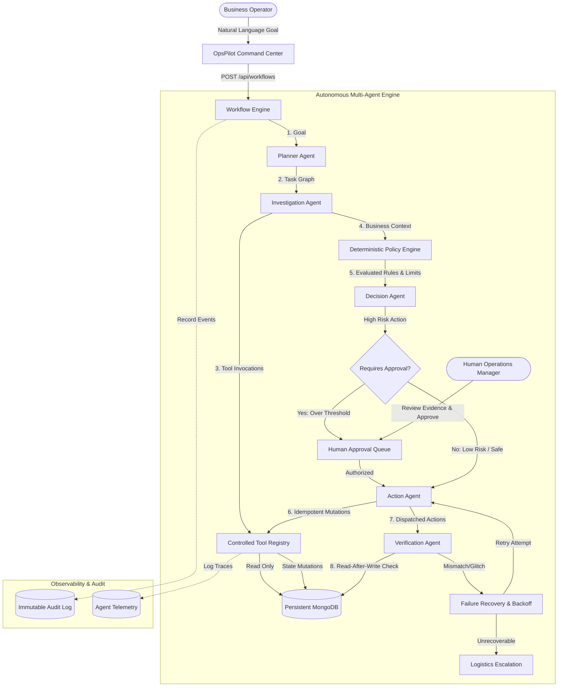

# OpsPilot AI — System Architecture

OpsPilot AI is an autonomous, agentic operations platform engineered around a foundational security and reliability axiom:

> **THE LLM REASONS. THE APPLICATION CONTROLS AUTHORITY.**

---

## 1. High-Level Architecture Diagram

---

## 2. Key Components

### 2.1 Natural Language Command Center
- Accepts non-technical high-level business goals.
- Provides immediate validation, feedback, and interactive execution tracking.

### 2.2 The Planner Agent
- Breaks down complex, multi-system operational objectives into a directed acyclic graph (DAG) of specialized tasks with explicit dependencies, agent assignments, and tool requirements.

### 2.3 The Controlled Tool Registry
- **Strict Zod Parameter Validation**: Every tool enforces strongly-typed schemas.
- **Auditing**: Every tool call produces `TOOL_CALLED` and `TOOL_RESULT` audit entries.
- **Zero Raw LLM Code Execution**: The LLM never writes raw SQL/Mongoose queries or touches the database directly.

### 2.4 The Deterministic Policy Engine
- Hard-coded application business logic that cannot be overridden by prompt engineering or LLM hallucinations.
- Automatically triggers Human-in-the-loop checkpoints when financial or operational thresholds are breached.

### 2.5 Human-in-the-Loop (HITL) Checkpoint
- Halts execution for financial actions exceeding ₹5,000.
- Serves decision evidence (delay hours, customer LTV, VIP status, policy references) to authorized managers.

### 2.6 The Action Agent & Idempotency Safeguards
- Dispatches state mutations with a unique `idempotencyKey` formatted as `${workflowId}-${actionType}-${targetId}`.
- Replaying the identical operation returns the previous result without duplicate charges or double refunds.

### 2.7 Verification Agent
- Never assumes an action succeeded solely based on HTTP 200 or database write acknowledgement.
- Re-queries the actual database state to confirm that records reflect the expected status and values.

### 2.8 Self-Healing Failure Recovery
- Handles transient network timeouts (such as courier SMS/email gateway latency) through deterministic exponential backoff retries.
- Escalates persistent failures to human operators.
